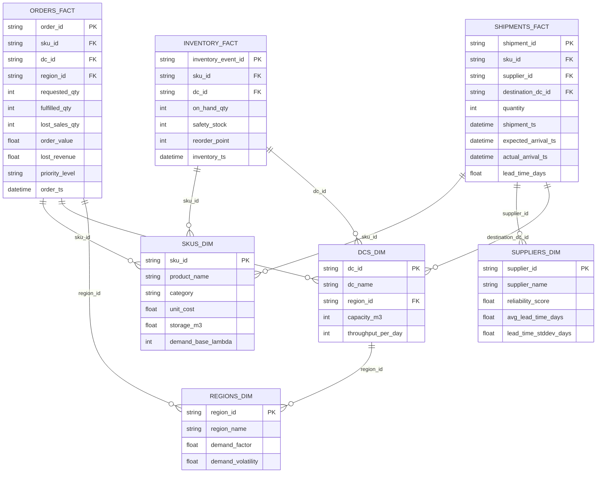
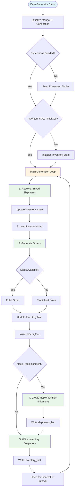
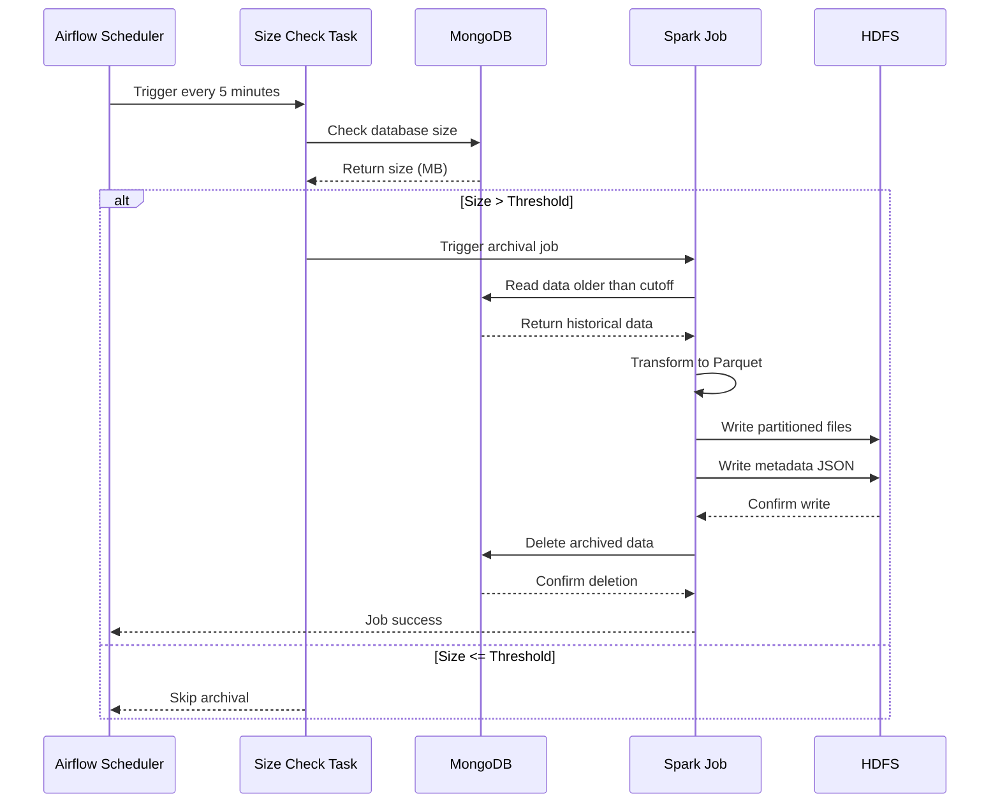
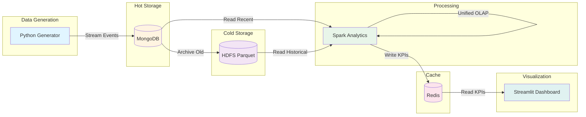
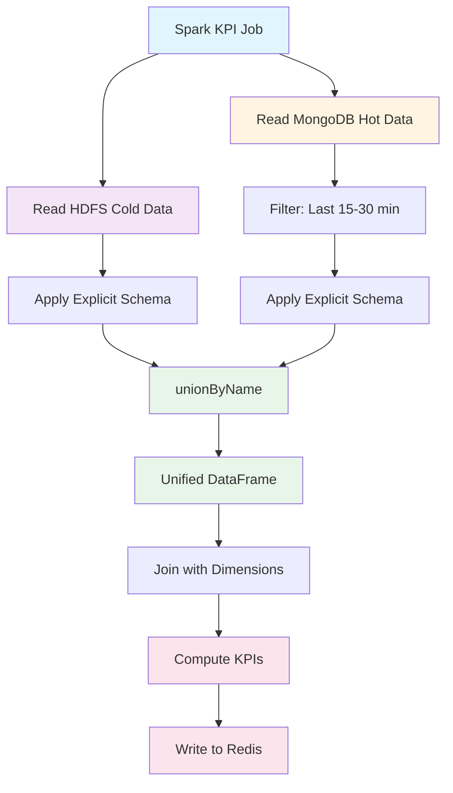
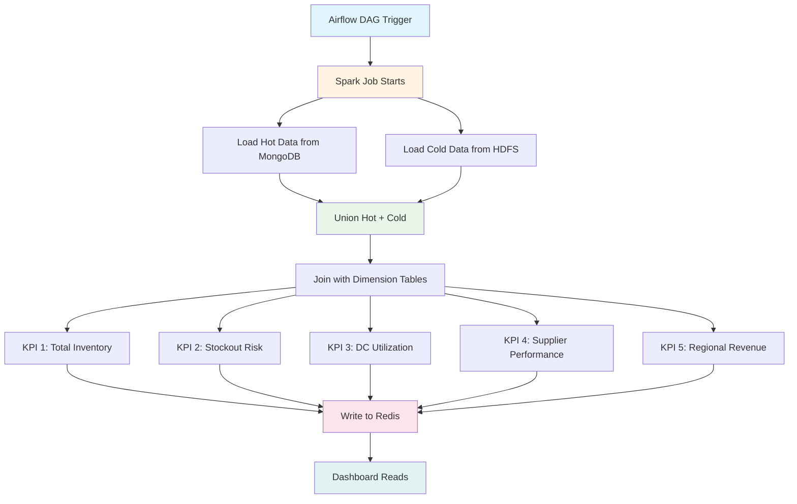

# Data Schema and Model Documentation

This document provides a comprehensive overview of the data model, schema definitions, and data flow for the Supply Chain Analytics pipeline.

## Table of Contents

- [Data Model Overview](#data-model-overview)
- [Star Schema Architecture](#star-schema-architecture)
- [Fact Tables](#fact-tables)
- [Dimension Tables](#dimension-tables)
- [Data Generation Process](#data-generation-process)
- [Data Storage and Archival](#data-storage-and-archival)
- [Data Flow Diagrams](#data-flow-diagrams)

## Data Model Overview

The system implements a **star schema** data model optimized for OLAP-style analytics. The architecture consists of:

- **3 Fact Tables**: Capture operational events (orders, inventory snapshots, shipments)
- **4 Dimension Tables**: Provide descriptive attributes (SKUs, DCs, regions, suppliers)
- **1 State Table**: Maintains current inventory state for operational logic

All data is stored in MongoDB as hot storage, with historical data archived to HDFS in Parquet format.

### Data Volume Characteristics

- **Generation Rate**: ~1,500 events per minute
- **Hot Storage Threshold**: 300 MB (MongoDB)
- **Demo Mode Threshold**: 30 MB (for quick demonstrations)
- **Archival Format**: Parquet files partitioned by `event_date` and `hour`
- **Retention**: Hot data (last 15-30 minutes), Cold data (HDFS archives)

## Star Schema Architecture



## Fact Tables

### Orders Fact (`orders_fact`)

Captures customer order events with fulfillment tracking and lost sales analysis.

**Grain**: One row per order event

**Fields**:

| Field | Type | Description |
|-------|------|-------------|
| `order_id` | String (UUID) | Unique order identifier |
| `sku_id` | String | Product identifier (FK to `skus_dim`) |
| `dc_id` | String | Distribution center identifier (FK to `dcs_dim`) |
| `region_id` | String | Geographic region identifier (FK to `regions_dim`) |
| `requested_qty` | Integer | Number of units requested by customer |
| `fulfilled_qty` | Integer | Number of units actually fulfilled from inventory |
| `lost_sales_qty` | Integer | Number of units that could not be fulfilled (stockout) |
| `quantity` | Integer | Alias for `fulfilled_qty` (backward compatibility) |
| `lost_sale_flag` | Boolean | True if any units were lost due to stockout |
| `order_value` | Float | Revenue from fulfilled units (PKR) |
| `lost_revenue` | Float | Estimated revenue lost due to stockout (PKR) |
| `priority_level` | String | Order priority: "HIGH", "NORMAL", "LOW" |
| `order_ts` | DateTime (UTC) | Timestamp when order was placed |

**Indexes**:
- `order_ts` (ascending)
- `(sku_id, dc_id, order_ts)` (compound)

**Generation Logic**:
- Orders generated using Poisson distribution based on SKU demand base lambda
- Regional demand factors and volatility applied
- Fulfillment respects available inventory (realistic stockout behavior)
- Order value calculated using log-normal distribution with 30% margin

### Inventory Fact (`inventory_fact`)

Contains periodic snapshots of inventory state across all SKU-DC combinations.

**Grain**: One row per SKU-DC snapshot per time interval

**Fields**:

| Field | Type | Description |
|-------|------|-------------|
| `inventory_event_id` | String (UUID) | Unique snapshot identifier |
| `sku_id` | String | Product identifier (FK to `skus_dim`) |
| `dc_id` | String | Distribution center identifier (FK to `dcs_dim`) |
| `on_hand_qty` | Integer | Current inventory level in units |
| `safety_stock` | Integer | Minimum buffer stock level for this SKU-DC |
| `reorder_point` | Integer | Inventory level that triggers replenishment orders |
| `inventory_ts` | DateTime (UTC) | Timestamp of the snapshot |

**Indexes**:
- `inventory_ts` (ascending)
- `(sku_id, dc_id, inventory_ts)` (compound)

**Generation Logic**:
- Snapshots created every generation interval (~4 seconds)
- Data sourced directly from `inventory_state` collection (no expensive queries)
- Reflects inventory after order fulfillment and shipment arrivals

### Shipments Fact (`shipments_fact`)

Tracks supplier shipments and replenishment orders from creation to arrival.

**Grain**: One row per shipment event

**Fields**:

| Field | Type | Description |
|-------|------|-------------|
| `shipment_id` | String (UUID) | Unique shipment identifier |
| `sku_id` | String | Product identifier (FK to `skus_dim`) |
| `supplier_id` | String | Supplier identifier (FK to `suppliers_dim`) |
| `destination_dc_id` | String | Target distribution center (FK to `dcs_dim`) |
| `quantity` | Integer | Number of units in shipment |
| `shipment_ts` | DateTime (UTC) | Timestamp when shipment was created |
| `expected_arrival_ts` | DateTime (UTC) | Projected arrival timestamp |
| `actual_arrival_ts` | DateTime (UTC) | Actual arrival timestamp (null until shipment arrives) |
| `lead_time_days` | Float | Calculated lead time from shipment creation to arrival |
| `shipment_type` | String | Type of shipment: "replenishment" |

**Indexes**:
- `(expected_arrival_ts, actual_arrival_ts)` (compound)
- `shipment_ts` (ascending)

**Generation Logic**:
- Shipments created based on reorder policy (when `on_hand_qty <= reorder_point`)
- Supplier selection weighted by reliability score
- Reorder quantity covers 21 days of demand (configurable)
- Lead time calculated using Normal distribution with supplier-specific parameters
- In demo mode, lead times accelerated (hours instead of days)

## Dimension Tables

### SKU Dimension (`skus_dim`)

Product master data for all SKUs in the supply chain.

**Fields**:

| Field | Type | Description |
|-------|------|-------------|
| `sku_id` | String | Unique product identifier (Primary Key) |
| `product_name` | String | Human-readable product name |
| `category` | String | Product category (e.g., "Staples", "Dairy", "Snacks") |
| `unit_cost` | Float | Base cost per unit (PKR) |
| `storage_m3` | Float | Storage space required per unit (cubic meters) |
| `demand_base_lambda` | Integer | Base demand rate (Poisson lambda parameter) |
| `lead_time_days` | Integer | Typical lead time for this SKU |
| `stock_coverage_days` | Integer | Initial stock coverage in days |

**Example SKUs**:
- Atta (Wheat Flour) - 10kg
- Basmati Rice - 5kg
- Fresh Milk - 1L
- Cooking Oil - 5L
- Sugar - 5kg
- Yogurt - 500g
- Chips Family Pack
- Soft Drink - 1.5L
- Dishwashing Liquid - 1L
- Cleaning Supplies

### Distribution Center Dimension (`dcs_dim`)

Warehouse and distribution center master data.

**Fields**:

| Field | Type | Description |
|-------|------|-------------|
| `dc_id` | String | Unique distribution center identifier (Primary Key) |
| `dc_name` | String | Human-readable DC name |
| `region_id` | String | Geographic region identifier (FK to `regions_dim`) |
| `capacity_m3` | Integer | Total storage capacity in cubic meters |
| `throughput_per_day` | Integer | Maximum units processed per day |
| `operating_cost_per_day` | Float | Daily operating cost (PKR) |

**Distribution Centers**:
- Karachi Central Warehouse (DC-KHI) - 75,000 m³ capacity
- Lahore Distribution Hub (DC-LHE) - 60,000 m³ capacity
- Islamabad Regional Center (DC-ISB) - 45,000 m³ capacity
- Faisalabad Warehouse (DC-FSD) - 40,000 m³ capacity
- Multan Distribution Point (DC-MUL) - 35,000 m³ capacity

### Region Dimension (`regions_dim`)

Geographic regions with demand characteristics.

**Fields**:

| Field | Type | Description |
|-------|------|-------------|
| `region_id` | String | Unique region identifier (Primary Key) |
| `region_name` | String | Human-readable region name |
| `demand_factor` | Float | Regional demand multiplier (relative to base) |
| `demand_volatility` | Float | Demand variance coefficient (0-1 scale) |

**Regions**:
- Sindh Province (PK-SINDH) - demand_factor: 2.0, volatility: 0.35
- Punjab North (PK-PUNJAB-NORTH) - demand_factor: 1.6, volatility: 0.28
- Punjab South (PK-PUNJAB-SOUTH) - demand_factor: 1.2, volatility: 0.25
- Capital Region (PK-CAPITAL) - demand_factor: 1.4, volatility: 0.22

### Supplier Dimension (`suppliers_dim`)

Supplier master data with performance characteristics.

**Fields**:

| Field | Type | Description |
|-------|------|-------------|
| `supplier_id` | String | Unique supplier identifier (Primary Key) |
| `supplier_name` | String | Human-readable supplier name |
| `reliability_score` | Float | Supplier reliability (0-1 scale, higher is better) |
| `avg_lead_time_days` | Float | Average lead time in days |
| `lead_time_stddev_days` | Float | Lead time standard deviation (variance indicator) |

**Supplier Types**:
- Local FMCG suppliers (high reliability, short lead time)
- Import-based suppliers (moderate reliability, longer lead time)

### Inventory State (`inventory_state`)

Operational state table maintaining current inventory levels (not a fact table, but critical for operations).

**Fields**:

| Field | Type | Description |
|-------|------|-------------|
| `sku_id` | String | Product identifier (FK to `skus_dim`) |
| `dc_id` | String | Distribution center identifier (FK to `dcs_dim`) |
| `on_hand_qty` | Integer | Current inventory level in units |
| `safety_stock` | Integer | Minimum buffer stock level |
| `reorder_point` | Integer | Inventory level that triggers replenishment |
| `last_updated` | DateTime (UTC) | Last update timestamp |

**Indexes**:
- `(sku_id, dc_id)` (unique compound index)

**Purpose**:
- Maintains current inventory state for operational logic
- Updated in real-time as orders are fulfilled and shipments arrive
- Used to generate inventory snapshots (`inventory_fact`)

## Data Generation Process



### Generation Parameters

- **Events per Minute**: ~1,500 events
- **Generation Interval**: 4 seconds
- **Order Distribution**: 60% of events are orders
- **Statistical Models**:
  - **Orders**: Poisson distribution (arrival rates)
  - **Quantities**: Poisson distribution (discrete counts)
  - **Order Values**: Log-normal distribution (right-skewed)
  - **Lead Times**: Normal distribution (with floor)
  - **Fulfillment Delays**: Exponential distribution (queue times)

### Realistic Business Logic

1. **Inventory Balance Equation**:
   ```
   Inventory(t+1) = Inventory(t) - FulfilledOrders(t) + ReceivedShipments(t)
   ```

2. **Reorder Policy**:
   - Triggered when `on_hand_qty <= reorder_point`
   - Reorder quantity covers 21 days of demand
   - Supplier selection weighted by reliability score

3. **Fulfillment Logic**:
   - Orders respect available inventory
   - `fulfilled_qty = min(requested_qty, available_qty)`
   - Lost sales tracked explicitly

4. **Demo Mode**:
   - Higher initial stock (configurable multiplier)
   - Accelerated lead times (hours instead of days)
   - Lower archival threshold (30 MB vs 300 MB)

## Data Storage and Archival

### Hot Storage (MongoDB)

**Purpose**: Store recent operational data for real-time analytics

**Collections**:
- `orders_fact`
- `inventory_fact`
- `shipments_fact`
- `skus_dim`
- `dcs_dim`
- `regions_dim`
- `suppliers_dim`
- `inventory_state`

**Retention**: Last 15-30 minutes of data (configurable)

**Thresholds**:
- **Production**: 300 MB
- **Demo Mode**: 30 MB

### Cold Storage (HDFS)

**Purpose**: Archive historical data for long-term analytics

**Format**: Parquet files

**Partitioning**:
```
/supply_chain_archive/
  {collection_name}/
    event_date={YYYY-MM-DD}/
      hour={HH}/
        part-*.parquet
```

**Metadata**:
- Stored in `/archive/metadata/` as JSON files
- Includes: `archive_id`, `collections`, `record_count`, `size_mb`, `date_range`, `created_at`

### Archival Process



## Data Flow Diagrams

### End-to-End Data Flow



### OLAP Unification Pattern



### KPI Computation Flow



## Data Dictionary Summary

### Fact Tables Summary

| Table | Grain | Primary Key | Foreign Keys | Time Column | Volume (per minute) |
|-------|-------|-------------|-------------|-------------|-------------------|
| `orders_fact` | One row per order | `order_id` | `sku_id`, `dc_id`, `region_id` | `order_ts` | ~900 events |
| `inventory_fact` | One row per SKU-DC snapshot | `inventory_event_id` | `sku_id`, `dc_id` | `inventory_ts` | ~150 snapshots |
| `shipments_fact` | One row per shipment | `shipment_id` | `sku_id`, `supplier_id`, `destination_dc_id` | `shipment_ts` | ~50 events |

### Dimension Tables Summary

| Table | Primary Key | Cardinality | Update Frequency |
|-------|------------|-------------|-------------------|
| `skus_dim` | `sku_id` | ~10 SKUs | Static (seeded once) |
| `dcs_dim` | `dc_id` | 5 DCs | Static (seeded once) |
| `regions_dim` | `region_id` | 4 regions | Static (seeded once) |
| `suppliers_dim` | `supplier_id` | ~8 suppliers | Static (seeded once) |

### Key Relationships

- **Orders → SKUs**: Many-to-one (many orders per SKU)
- **Orders → DCs**: Many-to-one (many orders per DC)
- **Orders → Regions**: Many-to-one (many orders per region)
- **Inventory → SKUs**: Many-to-one (many snapshots per SKU)
- **Inventory → DCs**: Many-to-one (many snapshots per DC)
- **Shipments → SKUs**: Many-to-one (many shipments per SKU)
- **Shipments → Suppliers**: Many-to-one (many shipments per supplier)
- **Shipments → DCs**: Many-to-one (many shipments per DC)
- **DCs → Regions**: Many-to-one (many DCs per region)

## Indexing Strategy

### MongoDB Indexes

**Fact Tables**:
- Time-based indexes for efficient time-window queries
- Compound indexes on (dimension_id, time) for filtered queries

**Dimension Tables**:
- Primary key indexes (automatic)

**State Table**:
- Unique compound index on (sku_id, dc_id) for fast lookups

### HDFS Partitioning

- Partitioned by `event_date` and `hour` for efficient pruning
- Parquet format for columnar storage and compression
- Metadata stored separately for quick archive discovery

## Data Quality and Constraints

### Business Rules

1. **Inventory Constraints**:
   - `on_hand_qty >= 0` (no negative inventory)
   - `fulfilled_qty <= requested_qty` (can't fulfill more than requested)
   - `lost_sales_qty = requested_qty - fulfilled_qty`

2. **Shipment Constraints**:
   - `actual_arrival_ts >= expected_arrival_ts` (arrivals can't be before expected)
   - `quantity > 0` (shipments must have positive quantity)

3. **Order Constraints**:
   - `order_value >= 0` (non-negative revenue)
   - `priority_level IN ('HIGH', 'NORMAL', 'LOW')`

### Data Validation

- UUID format validation for all ID fields
- Timestamp validation (UTC timezone)
- Numeric range validation (quantities, costs, etc.)
- Referential integrity (foreign keys must exist in dimension tables)

